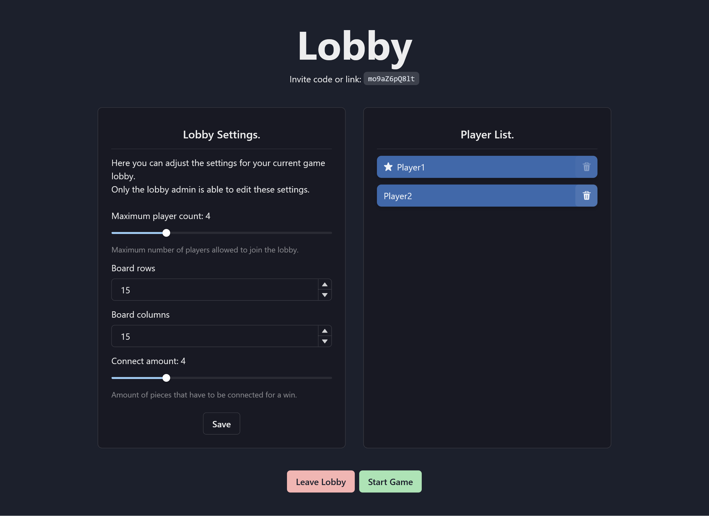

# ConnectX

Online multiplayer game like connect-four or four-in-a-row but instead of limited
to only two players or connecting only 4 pieces it can be played with multiple 
people, an adjustable board size and connect amount.

The frontend is written in React using Chakra as a UI-Library, while the backend
uses a GraphQL API with Redis for storing session and lobby states.

Live demo at: <https://connect-xr.web.app>

## Features

- No registration needed
- Invite other to your lobby or join one
- Adjustable lobby settings
- Dark/Light theme

## Home Screen

## Lobby Screen

## Game Screen

